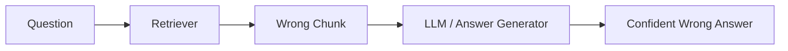
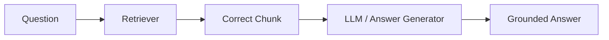
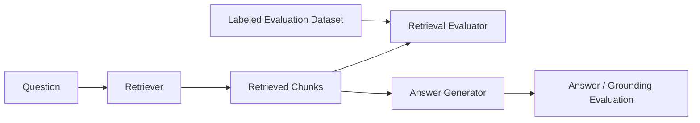

# Terkeka RAG Retrieval Evaluation

Reproducible retrieval and RAG-evaluation examples companion to the Terkeka **Retrieval Quality & AI Evaluation** article series.

**Terkeka owns the explanation. This repository owns the experiment.**

## Companion Articles

### Article 01 — When RAG Sounds Right but Retrieves Wrong

Canonical article: https://terkeka.com/articles/when-rag-sounds-right-but-retrieves-wrong/

> This repository is a companion implementation for a Terkeka engineering article. The article explains the engineering problem and reasoning; this repository provides the reproducible dataset, code, metrics, tests, and results.

### Article 02 — Why Answer Accuracy Is Not Retrieval Accuracy

Status: companion experiment implemented in this repository; article forthcoming.

See [Article 02 — Answer Accuracy vs Retrieval Accuracy](#article-02--answer-accuracy-vs-retrieval-accuracy) below.

## The Problem

A fluent or apparently correct answer does not prove that a RAG pipeline retrieved the correct evidence. A large language model can sound confident while being grounded in the wrong chunk — or in no real evidence at all.

**Failure path:**



**Success path:**



Both paths can produce a fluent-sounding answer. Only retrieval evaluation tells you which path you were actually on.

## Why Retrieval Evaluation Matters

RAG quality is not one thing — it is several separable concerns:

- **Retrieval quality** — did the retriever surface the right evidence?
- **Grounding quality** — does the generated answer actually rely on that evidence?
- **Reasoning quality** — did the model reason correctly over the evidence it was given?
- **Answer quality** — does the final answer read as correct to a human reviewer?

**Answer accuracy is not retrieval accuracy.** A model's prior knowledge can produce a correct-sounding answer even when the retriever handed it the wrong chunk — or nothing useful at all. That's the dangerous case: wrong retrieval plus an apparently correct answer, which masks a broken retriever until it fails on a question the model can't answer from prior knowledge alone.

This repository isolates the first concern — retrieval quality — and evaluates it independently, against labeled evidence, before any answer is generated.

## What This Repository Evaluates

- Whether the correct document chunk(s) were identified for a given question
- **Recall@K** — did the top K results contain the relevant evidence?
- **MRR** — how early did the first relevant result appear?
- **NDCG@K** — how good was the ranking order of relevant results?
- Correct-vs-wrong retrieval behavior, including a real case where a semantically similar distractor outranks the correct chunk
- Regression testing over a small labeled dataset

## Repository Structure

```text
terkeka-rag-retrieval-eval/
├── README.md
├── LICENSE
├── CONTRIBUTING.md
├── pyproject.toml
├── .github/
│   └── workflows/
│       └── ci.yml
├── data/
│   ├── documents/corpus.json
│   └── eval_dataset.json
├── experiments/
│   └── answer_vs_retrieval/        # Article 02
│       ├── README.md
│       ├── documents.json
│       ├── cases.json
│       └── expected_results.json
├── src/terkeka_rag_eval/
│   ├── __init__.py
│   ├── cli.py
│   ├── evaluator.py
│   ├── metrics.py
│   ├── models.py
│   ├── retrieval.py
│   ├── answer_evaluation.py        # Article 02
│   ├── grounding_evaluation.py     # Article 02
│   ├── rag_contract.py             # Article 02
│   └── article02.py                # Article 02
├── examples/
│   ├── correct_retrieval.py
│   ├── wrong_retrieval.py
│   ├── answer_vs_retrieval.py      # Article 02
│   └── evidence_ablation.py        # Article 02
├── tests/
│   ├── test_metrics.py
│   ├── test_retrieval.py
│   ├── test_answer_evaluation.py   # Article 02
│   ├── test_grounding_evaluation.py# Article 02
│   ├── test_rag_contract.py        # Article 02
│   └── test_article_02_experiment.py
├── docs/
│   ├── architecture.md
│   ├── evaluation-methodology.md
│   ├── answer-vs-retrieval.md            # Article 02
│   └── retrieval-aware-evaluation-contract.md # Article 02
├── diagrams/
│   └── rag-retrieval-failure.mmd
└── results/
    ├── baseline-results.md
    ├── baseline-results.json
    ├── article-02-results.md       # Article 02
    └── article-02-results.json     # Article 02
```

## Quick Start

Requires Python 3.11+.

```bash
python -m venv .venv
source .venv/bin/activate      # Windows: .venv\Scripts\activate

pip install -e ".[dev]"

pytest
terkeka-rag-eval evaluate
terkeka-rag-eval article02
```

`terkeka-rag-eval evaluate` is the CLI entry point defined in [`src/terkeka_rag_eval/cli.py`](src/terkeka_rag_eval/cli.py). It loads the corpus and labeled dataset, runs retrieval, and prints a JSON report. Useful flags:

```bash
terkeka-rag-eval evaluate -k 3 --json results/latest.json
```

`terkeka-rag-eval article02` runs the Article 02 answer-vs-retrieval experiment (see below). Useful flags:

```bash
terkeka-rag-eval article02 --json results/article-02-results.json --markdown results/article-02-results.md
```

## Run the Examples

```bash
python examples/correct_retrieval.py
python examples/wrong_retrieval.py
python examples/answer_vs_retrieval.py
python examples/evidence_ablation.py
```

- **`correct_retrieval.py`** runs the deterministic retriever normally and shows it ranking the correct chunk first, followed by a simulated grounded answer.
- **`wrong_retrieval.py`** forces a known-wrong chunk to the top of the ranking (via `retrieve_with_forced_wrong_chunk`) and shows that the same answer simulator still produces a fluent-sounding answer — demonstrating that answer appearance cannot be used as proof of retrieval correctness. No external LLM is called; the "answer" is a deterministic template over the top retrieved chunk.
- **`answer_vs_retrieval.py`** (Article 02) runs the four controlled cases described below and prints the retrieval/grounding/answer/overall diagnosis for each.
- **`evidence_ablation.py`** (Article 02) runs the same question under three evidence conditions and prints the resulting diagnosis table.

## Evaluation Dataset

Each evaluation case is a labeled retrieval example, not a production dataset:

### Dataset Notice

All documents, queries, relevance labels, and evaluation examples in this repository are synthetic and were created solely for demonstrating retrieval and RAG evaluation techniques.

They are not derived from any production system, proprietary dataset, confidential information, or internal business process.

```json
{
  "query_id": "policy-001",
  "question": "What is the cancellation notice period?",
  "relevant_chunk_ids": ["policy-cancel-01"],
  "relevance": {"policy-cancel-01": 3},
  "expected_facts": ["Cancellation requires 30 days notice."]
}
```

`relevant_chunk_ids` is the binary relevant set used for Recall@K and MRR. `relevance` is a graded-relevance map used for NDCG@K — it can also score a topically related but incorrect chunk (a distractor) above zero without treating it as a correct answer. The dataset (`data/eval_dataset.json`) deliberately includes:

1. **Obvious correct retrieval** — direct questions with one unambiguous relevant chunk.
2. **A semantically similar distractor** — `support-002` asks about a "non-critical" incident; the retriever has no notion of negation and ranks the "critical" incident chunk first.
3. **A real wrong-retrieval risk** — the same `support-002` case: Recall@3 still succeeds (the right chunk is in the top 3), but MRR and NDCG@3 drop because it isn't ranked first.
4. **Multiple relevant chunks** — `policy-003` has two chunks that both answer the question.
5. **Ranking quality** — `support-002` again, since it is specifically a ranking-order failure, not a missing-evidence failure.

See [`results/baseline-results.md`](results/baseline-results.md) for the actual measured outcome of each case.

## Metrics

### Recall@K
Did the retriever find relevant evidence in the top K results? A binary hit/miss signal per relevant chunk, aggregated over the query.

### MRR
How early did the first relevant result appear? `1 / rank` of the first relevant chunk, `0` if none was found. Penalizes a correct chunk being buried behind irrelevant ones.

### NDCG@K
How good was the ranked ordering of relevant results, using graded relevance? Rewards putting more relevant chunks earlier, and can distinguish "correct but poorly ranked" from "correct and well ranked" — which Recall@K alone cannot.

Implementations: [`src/terkeka_rag_eval/metrics.py`](src/terkeka_rag_eval/metrics.py). Unit tests, including edge cases (no relevant results, K exceeding result length, divide-by-zero guards): [`tests/test_metrics.py`](tests/test_metrics.py).

## Baseline Results

> Toy baseline results from the included deterministic example corpus. These are not production benchmark claims.

Generated by actually running the evaluator against `data/eval_dataset.json` (8 cases, `top_k = 3`):

| Metric        | Score |
|---------------|-------|
| Mean Recall@3 | 1.000 |
| MRR           | 0.938 |
| Mean NDCG@3   | 0.964 |

MRR and NDCG@3 are below 1.0 specifically because of the `support-002` distractor case described above — the aggregate numbers reflect a real, reproducible ranking imperfection rather than a manufactured example. Full per-query results and commentary: [`results/baseline-results.md`](results/baseline-results.md) / [`results/baseline-results.json`](results/baseline-results.json).

## Article 02 — Answer Accuracy vs Retrieval Accuracy

Article 01 evaluates whether retrieval found the right evidence. Article 02 asks a different, complementary question: **does a correct final answer prove that it did?** It does not. A model can produce a fluent, correct-looking answer while the evidence path underneath it is broken — grounded in the wrong chunk, or in no retrieved evidence at all.

This repository evaluates that gap with four independent, composable checks over a controlled, deterministic experiment ([`experiments/answer_vs_retrieval/`](experiments/answer_vs_retrieval/)):

- **Retrieval** — was the labeled-relevant evidence chunk actually retrieved? ([`rag_contract.evaluate_retrieval`](src/terkeka_rag_eval/rag_contract.py))
- **Grounding** — does the text of what was retrieved actually contain the fact needed to answer correctly? ([`grounding_evaluation.evaluate_grounding`](src/terkeka_rag_eval/grounding_evaluation.py))
- **Answer** — does the generated answer match the expected answer? ([`answer_evaluation.evaluate_answer`](src/terkeka_rag_eval/answer_evaluation.py))
- **Retrieval-aware overall contract** — `overall_pass = retrieval.passed AND grounding.passed AND answer.passed`. A correct answer cannot compensate for failed retrieval or failed grounding. ([`rag_contract.evaluate_rag_case`](src/terkeka_rag_eval/rag_contract.py))

### Four controlled cases

| Case | Retrieval | Grounding | Answer | Overall | Failure mode |
|------|-----------|-----------|--------|---------|--------------|
| A — correct retrieval, correct answer | PASS | PASS | PASS | PASS | `HEALTHY_RAG` |
| B — correct retrieval, wrong answer | PASS | PASS | FAIL | FAIL | `GENERATION_FAILURE` |
| C — wrong retrieval, wrong answer | FAIL | FAIL | FAIL | FAIL | `RETRIEVAL_FAILURE` |
| D — wrong retrieval, correct answer | FAIL | FAIL | PASS | FAIL | `CORRECT_ANSWER_WRONG_EVIDENCE` |

**Case D is the primary experiment.** An answer-only evaluator would call it a success. The retrieval-aware contract correctly rejects it, because the evidence that was actually retrieved does not support the answer that was generated.

### Evidence-ablation experiment

The same question, with the same deterministic `generated_answer` fixture, run under three evidence conditions (correct evidence / wrong evidence / no evidence). It demonstrates how to check whether retrieval actually contributed to a correct answer — not that retrieval is globally unnecessary. See [`docs/answer-vs-retrieval.md`](docs/answer-vs-retrieval.md) for the full pipeline diagram and [`results/article-02-results.md`](results/article-02-results.md) for the measured output.

### Scope and determinism

Like Article 01, this experiment is fully offline and deterministic: no OpenAI/Anthropic/Bedrock calls, no vector database, no cloud credentials. Where the experiment needs a "generated answer," it uses an explicitly labeled deterministic/simulated fixture (`experiments/answer_vs_retrieval/cases.json`), not live LLM output — the goal is to demonstrate evaluation mechanics, not to benchmark a model. See [`docs/retrieval-aware-evaluation-contract.md`](docs/retrieval-aware-evaluation-contract.md) for the full classification rules and limitations.

### Reproduce

```bash
terkeka-rag-eval article02
terkeka-rag-eval article02 --json results/article-02-results.json --markdown results/article-02-results.md
```

## Architecture



Retrieval evaluation (`C → E`) runs independently of answer generation (`C → A → G`). This is the core architectural principle: retrieval evaluation must not depend on whether the final answer merely *looks* correct. Both branches consume the same retrieved chunks, but only one of them is compared against labeled ground truth. See [`docs/architecture.md`](docs/architecture.md) for more detail.

## CI/CD

[`.github/workflows/ci.yml`](.github/workflows/ci.yml) runs on every pull request and on pushes to `main`. It installs the project, runs `pytest` (Article 01 and Article 02 tests), runs the Article 01 evaluator against the labeled dataset, and runs the Article 02 experiment, uploading both JSON/Markdown reports as build artifacts. It requires no secrets and no cloud credentials.

**Future goal (not yet implemented):** retrieval evaluation can become a regression gate for changes to chunking, embeddings, metadata filters, retrieval algorithms, reranking, or knowledge-base contents — failing CI if Recall@K/MRR/NDCG@K drop below an accepted baseline. See [`docs/evaluation-methodology.md`](docs/evaluation-methodology.md) for an example threshold policy.

## Educational Scope

v1 intentionally uses a deterministic, keyword-overlap retriever (see [`src/terkeka_rag_eval/retrieval.py`](src/terkeka_rag_eval/retrieval.py)) so readers can understand the evaluation mechanics without needing cloud credentials, API keys, a vector database, or a paid LLM API. It is explicitly **not** a production retrieval implementation — it exists to make retrieval evaluation reproducible in a few minutes on a laptop.

## Roadmap

Two separate tracks: **article experiments** (what each Terkeka article's companion implementation demonstrates) and the **repository implementation roadmap** (the underlying retrieval/evaluation machinery). Article 02 is a new experiment built on the same repository, not a new roadmap version — it does not change or replace the v1 retriever below.

### Article experiments
- **Article 01** — retrieval evaluation foundation: Recall@K/MRR/NDCG@K against a labeled dataset.
- **Article 02** — retrieval vs. answer correctness: four controlled cases, a retrieval-aware evaluation contract, and an evidence-ablation experiment.

### Repository implementation roadmap

#### v1 — Deterministic Retrieval Evaluation (this repository)
- Deterministic keyword-overlap retrieval
- Labeled evaluation dataset
- Recall@K, MRR, NDCG@K
- Correct/wrong retrieval demonstrations
- Retrieval-aware evaluation contract (retrieval / grounding / answer / overall) — Article 02
- Automated tests
- CI

#### v2 — Retrieval Strategy Comparison *(planned, not implemented)*
- BM25
- Embedding-based retrieval
- Hybrid retrieval
- Reranking
- Retrieval strategy comparison

#### v3 — Production Evaluation *(planned, not implemented)*
- Larger, versioned datasets
- Experiment tracking
- Retrieval regression gates in CI
- Observability
- CI/CD thresholds

## Contributing

See [CONTRIBUTING.md](CONTRIBUTING.md).

## License

MIT. See [LICENSE](LICENSE).

## About Terkeka

Terkeka is an engineering knowledge platform focused on AI, GenAI, RAG, evaluation, agentic systems, cloud architecture, and software engineering.

**Engineering Knowledge, Shared Forward.**
